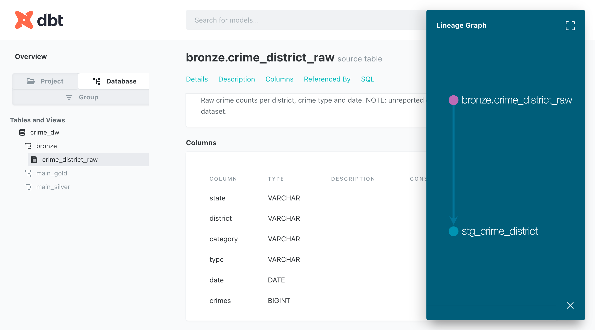

# Crime Data Warehouse — Crimes by District & Crime Type

A one-day mini data warehouse built with a medallion architecture (bronze → silver → gold), using **dbt-core** for transformation and **DuckDB** as the embedded warehouse engine. All tools are 100% free and open-source.

**Dataset:** [Crimes by District & Crime Type](https://data.gov.my) (data.gov.my / OpenDOSM), catalogue ID `crime_district` — a national public dataset released by the Government of Malaysia.

## Why this dataset

Crime statistics are directly domain-adjacent to the mandate of SPRM/BPRM (integrity and anti-corruption enforcement): law-enforcement agencies depend on consistent, cleaned, queryable crime data for operational reporting. This project demonstrates exactly that workflow.

## Architecture



```
┌─────────────┐     ┌──────────────────────┐     ┌──────────────────────────────┐
│  BRONZE     │     │  SILVER              │     │  GOLD (star schema)          │
│  raw data   │ ──► │  staging / cleaned   │ ──► │  dim_district                │
│  as-is      │     │  stg_crime_district  │     │  dim_crime_type              │
│  (Parquet)  │     │  (cast types,        │     │  fact_crime                  │
│             │     │   rename columns)    │     │  (district_key, crime_type_  │
│             │     │                      │     │   key, crime_date, count)    │
└─────────────┘     └──────────────────────┘     └──────────────────────────────┘
```

- **Bronze** (`scripts/ingest.py` → schema `bronze`): the raw Parquet file is landed untouched. No transformation.
- **Silver** (`models/staging` → schema `silver`): staging view with only type casting and column renaming — no business logic.
- **Gold** (`models/marts` → schema `gold`): a proper star schema — two dimension tables and one fact table keyed by surrogate keys.

## Tech stack

| Layer | Tool |
|---|---|
| Data source | data.gov.my Open API / Parquet (no auth needed) |
| Storage + compute | DuckDB |
| Transformation | dbt-core + dbt-duckdb |
| Version control | Git + GitHub |

## How to run

```bash
python3 -m venv venv && source venv/bin/activate
pip install dbt-core dbt-duckdb duckdb pandas

# 1. Bronze: land raw data
python crime_dw/scripts/ingest.py

# 2. Silver + Gold: build models
cd crime_dw
dbt run

# 3. Validate with data tests
dbt test

# 4. Generate and serve lineage docs
dbt docs generate
dbt docs serve
```

`dbt docs serve` opens a browser with an auto-generated lineage graph of the whole pipeline.

## Data quality caveat

This dataset counts **reported** crimes only — unreported crimes are not included, so figures may understate actual crime levels. The raw source also includes national aggregates (`state = 'Malaysia'`, `district = 'All'`, `type = 'all'`) alongside district-level rows; analyses should filter these as appropriate.

## Repo layout

```
crime-warehouse/
├── crime_dw/                  # dbt project
│   ├── scripts/ingest.py      # bronze ingest
│   ├── models/
│   │   ├── staging/           # silver layer
│   │   │   ├── stg_crime_district.sql
│   │   │   └── sources.yml
│   │   └── marts/             # gold layer
│   │       ├── dim_district.sql
│   │       ├── dim_crime_type.sql
│   │       ├── fact_crime.sql
│   │       └── schema.yml     # tests + docs
│   └── dbt_project.yml
└── venv/                      # not committed
```
